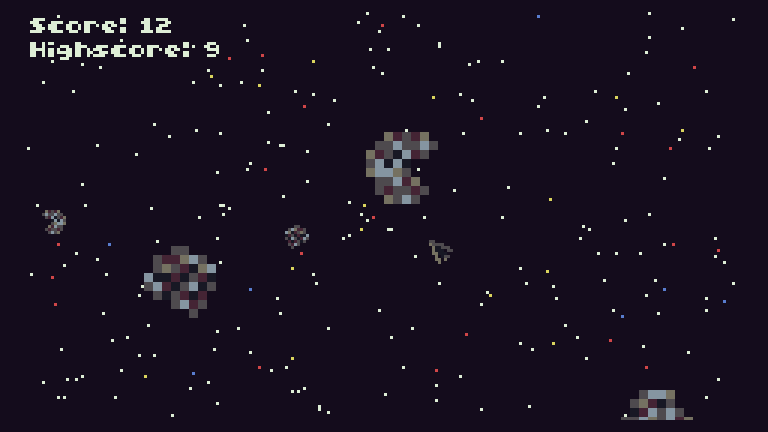

# Comets
Comets is an arcade game, made for the [TIC-80 fantasy console](https://tic80.com/).

Inspired by ["Asteroids"](https://en.wikipedia.org/wiki/Asteroids_(video_game)).

## Getting the game
You have the following options:

- Get it from [itch.io](https://nalquas.itch.io/comets)
- Get it from [tic80.com](https://tic80.com/play?cart=165)
- Get it from [GitHub](https://github.com/nalquas/comets)

## How to play
You control a spaceship inside of a swarm of comets. Your goal is to avoid being hit by comets and to destroy as many of them as possible.

Be careful when shooting a comet, as they split into two smaller comets when hit.

## Controls
- Movement: directional keys (normally arrow keys)
- Shooting: Any button (normally A/S/Z/X on your keyboard)

## How to use development version
If you **don't** have TIC-80 Pro, please download the `.tic` cartridge in the GitHub release tab instead. The normal TIC-80 build can't open `.lua` formatted development cartridges. Alternatively, you should also be able to use a self-compiled version of TIC-80.

Assuming you have TIC-80 Pro installed, you can install the `.lua` dev cartridge like this:

- Run TIC-80 Pro
- Type `folder` to open your TIC-80 directory
- Copy `comets.lua` into the folder
- Type `load comets.lua`, then `run`
